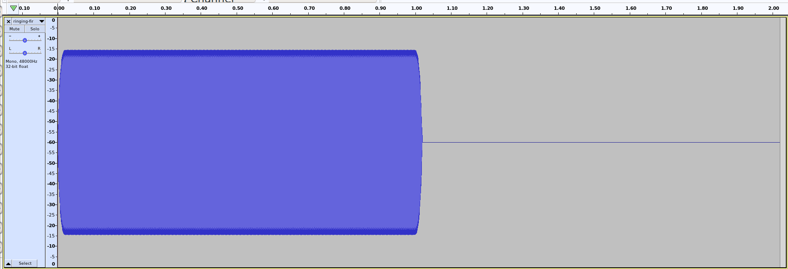
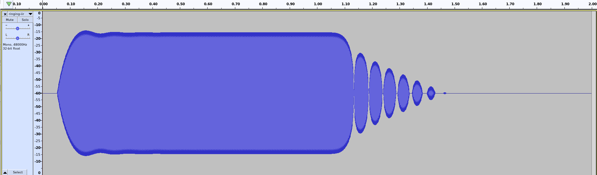

# ringing: IIR Filter Ringing Demo
Bart Massey 2022

This demo shows a difference between FIR and IIR filtering.

`ringing.py` generates an excitation signal by mixing three
one-second sine waves — 700Hz, 1000Hz and 1400Hz — and then
appending a one-second silence. This excitation is written
to `ringing-in.wav`.

## FIR

The excitation is narrowly bandpass filtered at 1000Hz with
a 1023-point FIR windowed filter. The result is written to
`smearing-fir.wav`.

The FIR-filtered signal has a fairly sharp start and stop
point: it transitions from zero to full over the width of
the 1023 point window, and similarly from full to zero. This
"smearing" can be reduced by narrowing the window, but at
the expense of a wider passband.

## IIR

The excitation is narrowly bandpass filtered at 1000Hz with
a 10-pole IIR filter. The result is written to
`ringing-iir.wav`.

The IIR-filtered signal fades in over about 150ms and fades
out over about 450ms. The fade out oscillates severely.
This is because the IIR filter takes past history into
account: the filter "rings" with a decay time roughly
proportional to the filter gain at its peak frequency.

This is the price we pay for doing a fraction of the
calculation. It is also a more faithful recreation of an
analog filter.
